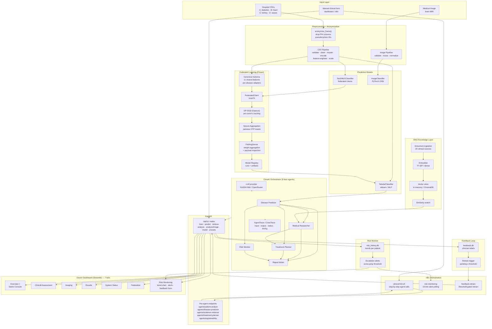

# Healthcare AI Framework

Federated multi-agent healthcare intelligence framework. End to end:
CSV / image input → preprocessing → model prediction → risk scoring →
RAG evidence → CrewAI multi-agent report → FastAPI → n8n orchestration →
Streamlit doctor dashboard.

**CPU-only friendly** — no GPU required. All models are small.

## System Flowchart



## Components

| Component | Entry point | Purpose |
| --------- | ----------- | ------- |
| FastAPI backend | `backend/api/main.py` | Train / predict / retrieve / analyze + per-agent endpoints for n8n step-by-step orchestration |
| Multi-agent crew | `backend/CrewAI/orchestrator/` | 5 lean agents; deterministic tool pipeline + optional LLM layer; merged clinical report |
| RAG | `backend/rag/` | TF-IDF (default) or dense embedding + in-memory / ChromaDB store; 20-doc medical corpus in `backend/rag/corpus/`; 18-query evaluation set |
| Federated learning | `backend/federated/` | Flower FedAvg with opt-in DP-SGD (Opacus) + pairwise OTP secure aggregation; canonical schema adapters; payload inspection; model registry |
| Models | `backend/models/` | Tabular (sklearn / PyTorch MLP) + image CNN classifiers |
| Preprocessing | `backend/preprocessing/` | CSV pipeline + image pipeline; anonymization wired at ingestion |
| Feedback loop | `backend/feedback/` | Clinician feedback SQLite store + threshold-gated retrain trigger |
| Risk monitoring | `backend/risk/` | Longitudinal risk history, trend analysis, escalation alerts |
| Streamlit dashboard | `frontend/streamlit_app.py` | Doctor-facing CDS UI — 7 tabs incl. Risk Monitoring + One-Click Demo Console |
| n8n automation | `n8n/*.json` | `clinical-full-v2` (per-agent), `risk-monitoring` (15-min polls), `feedback-retrain`, `healthcare-endtoend` (retired flows in `n8n/archive/`) |
| Datasets | `backend/data/hospitals/` | Per-hospital specialty CSVs: A=diabetes, B=heart, C=kidney, D=sepsis (never committed raw PHI) |

## Quick Start

Prerequisites: Python 3.12+ venv with `backend/requirements.txt`, plus the
datasets in `~/dataset/` (not bundled in the repo).

**1. Start the backend** (model loads lazily, so the API starts even
before any model exists):

```bash
cd backend
DATASET_DIR=~/dataset \
  CrewAI/.venv-opencode/bin/python -m uvicorn api.main:app \
  --host 127.0.0.1 --port 8000
```

Check: `curl localhost:8000/health`.

**2. Train a model** through the API — central fit:

```bash
curl -X POST localhost:8000/api/v1/train \
  -H "Content-Type: application/json" \
  -d '{"preset": "diabetes", "model": "mlp"}'
```

Or federated (FedAvg over simulated hospital clients):

```bash
curl -X POST localhost:8000/api/v1/train \
  -H "Content-Type: application/json" \
  -d '{"preset": "diabetes", "federated": true, "clients": 3, "rounds": 3}'
```

Presets: `diabetes`, `heart`, `kidney`, `sepsis` (also `dataset` +
`target` for arbitrary CSVs). The new model is served immediately — no
restart.

**3. Run a clinical analysis** (predict → risk → RAG evidence → report):

```bash
curl -X POST localhost:8000/api/v1/analyze \
  -H "Content-Type: application/json" \
  -d '{
    "patient": {"id": "p-1", "name": "Patient A", "age": 30},
    "features": {"pregnancies":5.0,"glucose":116.0,"bloodpressure":74.0,
                 "skinthickness":27.0,"insulin":102.5,"bmi":25.6,
                 "diabetespedigreefunction":0.201,"age":30.0},
    "markers": {"glucose":116.0,"bmi":25.6,"age":30.0}
  }'
```

Also available: `POST /api/v1/predict` (single row) and
`POST /api/v1/retrieve` (RAG evidence).

**4. Start the dashboard** (http://localhost:8501):

```bash
cd frontend
../backend/CrewAI/.venv-opencode/bin/python -m streamlit run streamlit_app.py
```

The sidebar configures the backend URL, optional API token, n8n URL, and
the analysis route (n8n when reachable, else direct FastAPI).

The **Federation** tab inspects the multi-hospital model registry
(distributed runs, per-condition versioned global models, per-round
accuracy chart) and can trigger new distributed Flower training with
optional secure aggregation and DP-SGD. It reads the
`/api/v1/federation/*` endpoints; when no distributed run has been
recorded yet, the tab shows a guidance message instead of failing.

**5. n8n** — one workflow drives the whole lifecycle:

```bash
docker run -d --rm --name healthcare-n8n -p 5678:5678 \
  -v healthcare_n8n_data:/home/node/.n8n n8nio/n8n
```

Backend URL: workflows call the API through `$env.BACKEND_URL`,
defaulting to `http://127.0.0.1:8000`. From Docker, `127.0.0.1` is the
n8n container itself — either run with `--network=host` or set
`BACKEND_URL` (e.g. `http://host.docker.internal:8000`) in the n8n
container environment. The shipped workflows call the API with no
auth, matching the default token-less backend; if you set
`API_TOKEN`, attach an `httpHeaderAuth` credential to the HTTP
nodes yourself.

Open http://localhost:5678, import `n8n/healthcare-endtoend.json`,
activate it, then drive everything with one request:

```bash
curl -X POST http://localhost:5678/webhook/healthcare-endtoend \
  -H "Content-Type: application/json" \
  -d '{"train": true, "preset": "diabetes",
       "patient": {"id": "smoke-1"},
       "features": {"pregnancies":5.0,"glucose":116.0,"bloodpressure":74.0,
                    "skinthickness":27.0,"insulin":102.5,"bmi":25.6,
                    "diabetespedigreefunction":0.201,"age":30.0}}'
```

The workflow trains the model (if requested), analyzes the patient, and
returns the full structured report in the webhook response. When the
analysis is classified as **high risk**, the workflow also fires a
doctor-notification webhook (`DOCTOR_NOTIFY_WEBHOOK`, an n8n environment
variable — e.g. a pager/chat-bot endpoint or a hospital notification
service). The notification is best-effort: a failed notify never blocks
the webhook response.

The `n8n/clinical-full-v2.json` workflow implements the proposal's full
10-step orchestration (`POST /webhook/clinical-full-v2`): receive →
validate/route → per-agent federated analysis (prediction → RAG →
treatment → explainability via `/api/v1/agents/*`) → report validation
→ store (risk history / registry) → doctor notification on high risk →
respond. Invalid payloads get a structured rejection; the notify branch
is best-effort and never blocks the clinical response. (The retired
`n8n/archive/` flows — monolithic `clinical-full` and analyze-only
`clinical-analysis` — are superseded by v2 and `healthcare-endtoend`.) `n8n/clinical-full-v2.json`
(`POST /webhook/clinical-full-v2`) is the same flow routed through the
per-agent `/api/v1/agents/*` endpoints step by step instead of the
monolithic analyze call.

### Feedback-Driven Retraining

Clinicians can confirm (or correct) the outcome label of a past analysis
via `POST /api/v1/feedback`. Feedback samples persist in the SQLite store
(`FEEDBACK_DB_PATH`, default `artifacts/feedback.db`). Once pending samples
for a preset reach `FEEDBACK_RETRAIN_THRESHOLD` (default 5),
`POST /api/v1/feedback/retrain` retrains that preset on the base dataset
augmented with the feedback rows, writes the new artifact to
`artifacts/<preset>/global_model.joblib`, serves it immediately (no
restart), and marks the consumed samples so they are not reused.

The `n8n/feedback-retrain.json` workflow automates this:
`POST /webhook/feedback-retrain` with `{"preset": "diabetes"}` checks
retrain readiness and, when the threshold is met, triggers the retrain and
returns the new model's metrics; otherwise it returns
`{"status": "not_ready", "pending": <n>, "threshold": <t>}`. Set
`FEEDBACK_RETRAIN_ENABLED=false` to record feedback but disable automated
retraining.

### Risk Monitoring & History

Every clinical analysis (`POST /api/v1/analyze`) now persists the risk
assessment (score, level, prediction, confidence, markers) to a SQLite
store (`RISK_HISTORY_DB_PATH`, default `artifacts/risk_history.db`).
This enables longitudinal monitoring of patient risk over time.

Key features:
- **Trend analysis**: `GET /api/v1/risk/trends/{patient_id}` computes
  a linear trend over the recent window (`RISK_HISTORY_TREND_WINDOW`,
  default 5 analyses) and returns direction (improving/stable/worsening),
  slope, and escalation flag.
- **Escalation alerts**: When a patient's risk score increases by more
  than `RISK_HISTORY_ESCALATION_THRESHOLD` (default 0.2) compared to the
  previous analysis, an alert is generated. Retrieve all active alerts
  via `GET /api/v1/risk/alerts`.
- **History summaries**: `GET /api/v1/risk/history` returns per-patient
  summaries with total analyses, latest risk, trend, and alert count.
  Filter by patient/preset with query parameters.
- **Minimum points**: Trend analysis requires
  `RISK_HISTORY_MIN_TREND_POINTS` (default 3) data points.

The `n8n/risk-monitoring.json` workflow polls
`/api/v1/risk/alerts` every 15 minutes and notifies clinicians per
alert (it dedupes via workflow static data, so each escalation
notifies once).

Set `RISK_HISTORY_ALERTS_ENABLED=false` to record history but disable
automated alerting.

## API Endpoints

| Method | Path | Description |
| ------ | ---- | ----------- |
| GET | `/` | Service info |
| GET | `/health` | Liveness |
| GET | `/api/v1/model` | Model metadata (features / classes) |
| GET | `/api/v1/federation/status` | Federation registry overview (runs / models / per-preset latest) |
| GET | `/api/v1/federation/runs` | List federation runs (optional `?preset=`) |
| GET | `/api/v1/federation/models` | List registered global models (optional `?preset=`) |
| GET | `/api/v1/federation/runs/{run_id}/rounds` | Per-round metrics of a federation run |
| POST | `/api/v1/train` | Train a model (central or federated) and serve it |
| POST | `/api/v1/predict` | Classify one feature row |
| POST | `/api/v1/retrieve` | RAG evidence retrieval |
| POST | `/api/v1/analyze` | Full clinical report (prediction, risk, evidence, recommendations) |
| POST | `/api/v1/analyze/image` | Image-based clinical report (base64 image body) |
| POST | `/api/v1/analyze/csv` | CSV-upload clinical report |
| GET | `/api/v1/presets` | Available dataset presets |
| POST | `/api/v1/feedback` | Record a clinician-confirmed label for a past analysis |
| GET | `/api/v1/feedback/status` | Pending feedback + retrain readiness per preset |
| POST | `/api/v1/feedback/retrain` | Retrain a preset on base data + pending feedback and redeploy |
| GET | `/api/v1/risk/history` | Risk history summaries with trends for all patients |
| GET | `/api/v1/risk/history/{patient_id}` | Detailed risk history for a patient-preset |
| GET | `/api/v1/risk/trends/{patient_id}` | Computed risk trend (direction, slope, escalation) |
| GET | `/api/v1/risk/alerts` | Active escalation alerts (risk score jumps) |
| POST | `/api/v1/agents/patient-analyst` | Per-agent step: patient summary |
| POST | `/api/v1/agents/disease-predictor` | Per-agent step: prediction + risk |
| POST | `/api/v1/agents/evidence-retrieval` | Per-agent step: RAG evidence |
| POST | `/api/v1/agents/treatment-planner` | Per-agent step: recommendations |
| POST | `/api/v1/agents/explainability` | Per-agent step: explanation |

Optional bearer auth: set `API_TOKEN` and send
`Authorization: Bearer <token>` (all `/api/v1` routes).

## Configuration

Environment variables (all optional, see `backend/.env.example`):

- `API_MODEL_PATH` — path to a persisted tabular model
- `API_IMAGE_MODEL_PATH` — path to a persisted image CNN
- `API_CORPUS_DIR` — RAG knowledge directory of `.txt`/`.md` (empty uses
  the bundled medical corpus in `backend/rag/corpus/`)
- `API_DATASET_DIR` / `DATASET_DIR` — dataset directory
- `API_ARTIFACTS_DIR` — where trained models are written
- `API_TOKEN` — optional bearer token
- `CREW_LLM_PROVIDER` / `CREW_LLM_MODEL` / `CREW_LLM_API_KEY` /
  `CREW_LLM_BASE_URL` — the crew's LLM (Google Gemini by default;
  `CREW_LLM_BASE_URL` switches to any OpenAI-compatible endpoint
  such as NVIDIA NIM)
- `RAG_*` — embedding backend (`tfidf` default, `sentence-transformer`
  opt-in), vector store (`memory` default, `chroma` opt-in)
- `FED_*` — distributed Flower deployment (server address, registry,
  hospital dirs, TLS, subprocess timeout)
- `FEEDBACK_*` — feedback store path, retrain threshold/gating
- `RISK_HISTORY_*` — risk history store, trend window, escalation
  threshold, alert toggle
- `MODEL_*` / `PREPROCESS_*` — model seeds/training and CSV/image
  pipeline tuning

### CrewAI LLM

Every analysis runs through `crew.run()`: the deterministic pipeline
(prediction → risk → evidence → report) always runs; when an LLM is
configured, CrewAI agents enrich the narrative (summary, context,
recommendations, notices) while prediction/risk/evidence always come from
the models. If the LLM is unavailable or its output cannot be parsed, the
deterministic report is returned unchanged.

From `backend/`: `cp .env.example .env`, set `CREW_LLM_API_KEY` (NVIDIA
NIM key by default, or Gemini). Never commit `.env` — it is gitignored.

### Tuning for LLM providers

The lean 5-agent crew runs sequentially, one think→act→observe round
each — a kickoff is ~5-10 LLM calls total:

- `CREW_LLM_MAX_ITERATIONS` (default `1`) — values arrive in the task
  description, so one round suffices; raise for harder cases at the
  cost of wall-clock time and quota.
- `CREW_LLM_MAX_TOKENS` (default `1024`) — completion cap per call;
  very low values truncate tool-call JSON and long narratives.
- `CREW_LLM_TIMEOUT_SECONDS` (default `120`) — per-call provider
  timeout; keep it above queue+generation latency, otherwise calls die
  and the deterministic fallback kicks in.
- `CREW_LLM_MAX_RPM` (unset = no pacing) — per-agent calls per minute
  enforced natively by CrewAI; set `3` on strict free tiers so a
  kickoff slows down instead of tripping rate limits.

## Privacy & Security

- **Data protection (in-process)** — PHI stays on the client. Federated
  training supports Opacus DP-SGD (`differential_privacy=true`) and
  pairwise one-time-pad secure aggregation (`secure_aggregation=true`);
  the training response reports epsilon, MIA-AUROC, and leakage rate.
  Raw records are never returned by the API.
- **Access control** — optional static bearer token (`API_TOKEN`, off by
  default). Full OAuth is deferred.
- **Transport** — serve uvicorn behind a TLS-terminating reverse proxy
  at the deployment boundary.

Secrets policy: never commit `.env`, API keys, tokens, passwords, private
datasets, or hospital records. `backend/.env.example` and `.gitignore`
enforce this.

## Verification

With the test suite removed, verify the live system with:

1. `python -c "from api.main import create_app"` (from `backend/`) —
   all imports resolve.
2. `curl localhost:8000/health` — backend up.
3. A `POST /api/v1/analyze` call returns a report with `prediction`,
   `risk`, and `evidence`.

## Distributed Multi-Hospital Federation

Beyond the in-process FedAvg path (used by `/api/v1/train` with
`federated: true`), the framework ships a genuine distributed deployment
where each hospital runs as its **own process** and exchanges only model
weights with a real Flower gRPC server.

- `backend/federated/hospitals.py` — partitions a preset dataset into
  per-hospital local CSV slices (`FED_HOSPITALS_DIR`, default
  `data/hospitals/`). Each hospital preprocesses its own slice locally;
  raw rows never leave the site. The central hold-out is a stratified,
  class-balanced fold so it evaluates consistently.
- `backend/federated/distributed.py` — `run_distributed_server` /
  `run_hospital_client` over Flower gRPC, with a `DistributedFedAvg`
  strategy that keeps the pairwise OTP secure-aggregation semantics and
  records per-round metrics. A shared `ModelSpec` carries the canonical
  feature schema (derived from the full dataset) so every participant
  aligns its local features to the same columns even when the imputer
  would drop different columns per slice.
- `backend/federated/registry.py` — SQLite model registry
  (`FED_REGISTRY_PATH`, default `artifacts/federation.db`) storing runs,
  per-round metrics, and versioned global model artifacts.
- `backend/federated/__main__.py` — `python -m federated` launcher.

**Orchestrated run (server + N hospital processes on this machine):**

```bash
cd backend
DATASET_DIR=~/dataset python -m federated run \
  --preset diabetes --hospitals 4 --rounds 3 --secure-aggregation
```

Or split across hosts:

```bash
python -m federated sites --preset diabetes --hospitals 4          # build slices
python -m federated server --preset diabetes --hospitals 4 \
  --n-features 8 --n-classes 2 --address 0.0.0.0:8080              # on the server
python -m federated client --preset diabetes --hospitals 4 \
  --n-features 8 --n-classes 2 --hospital hospital_A \
  --address <server>:8080                                          # on each hospital
```

**Through the API** (`distributed` requires `federated` and a `preset`):

```bash
curl -X POST localhost:8000/api/v1/train \
  -H "Content-Type: application/json" \
  -d '{"preset": "diabetes", "federated": true, "distributed": true,
       "clients": 4, "rounds": 3, "differential_privacy": true,
       "secure_aggregation": true}'
```

The response `federated_metrics` reports the registry `run_id`, model
`version`, hold-out accuracy / ROC-AUC, and the worst-case DP epsilon.
Federation settings use the `FED_` prefix (`FED_SERVER_ADDRESS`,
`FED_HOSPITALS_DIR`, `FED_REGISTRY_PATH`, `FED_ARTIFACTS_DIR`,
`FED_DATASET_DIR`, `FED_SEED`).

**Registry inspection** — every distributed run is recorded in the
SQLite registry; query it through the API:

```bash
curl localhost:8000/api/v1/federation/status                 # overview
curl "localhost:8000/api/v1/federation/runs?preset=diabetes" # runs
curl "localhost:8000/api/v1/federation/models"               # global models
curl localhost:8000/api/v1/federation/runs/<run_id>/rounds   # round metrics
```