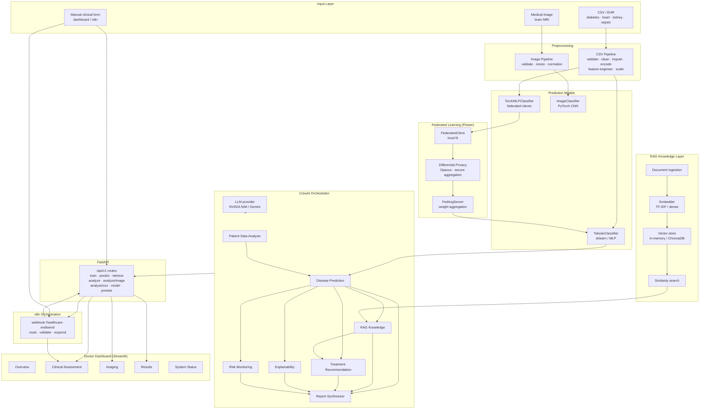

# Healthcare AI Framework

Federated multi-agent healthcare intelligence framework. End to end:
CSV / image input → preprocessing → model prediction → risk scoring →
RAG evidence → CrewAI multi-agent report → FastAPI → n8n orchestration →
Streamlit doctor dashboard.

**CPU-only friendly** — no GPU required. All models are small.

## System Flowchart



## Components

| Component | Entry point | Purpose |
| --------- | ----------- | ------- |
| FastAPI backend | `backend/api/main.py` | Train / predict / retrieve / analyze |
| Multi-agent crew | `backend/CrewAI/orchestrator/` | Deterministic tool pipeline + LLM agents; merged clinical report |
| RAG | `backend/rag/` | TF-IDF (default) or dense embedding + in-memory / ChromaDB store |
| Federated learning | `backend/federated/` | Flower FedAvg with opt-in DP (Opacus) + secure aggregation |
| Models | `backend/models/` | Tabular (sklearn / PyTorch MLP) + image CNN classifiers |
| Preprocessing | `backend/preprocessing/` | CSV pipeline + image pipeline |
| Streamlit dashboard | `frontend/streamlit_app.py` | Doctor-facing CDS UI (Overview / Assessment / Imaging / Results / System Status) |
| n8n automation | `n8n/healthcare-endtoend.json` | One workflow: train → analyze → respond |
| Datasets | `~/dataset/` | `diabetes.csv`, `heart_disease_uci.csv`, `kidney_disease.csv`, `sepsis_icu_synthetic.csv`, brain-tumor MRI |

## Quick Start

Prerequisites: Python 3.12+ venv with `backend/requirements.txt`, plus the
datasets in `~/dataset/` (not bundled in the repo).

**1. Start the backend** (model loads lazily, so the API starts even
before any model exists):

```bash
cd backend
DATASET_DIR=~/dataset \
  CrewAI/.venv-opencode/bin/python -m uvicorn api.main:app \
  --host 127.0.0.1 --port 8000
```

Check: `curl localhost:8000/health`.

**2. Train a model** through the API — central fit:

```bash
curl -X POST localhost:8000/api/v1/train \
  -H "Content-Type: application/json" \
  -d '{"preset": "diabetes", "model": "mlp"}'
```

Or federated (FedAvg over simulated hospital clients):

```bash
curl -X POST localhost:8000/api/v1/train \
  -H "Content-Type: application/json" \
  -d '{"preset": "diabetes", "federated": true, "clients": 3, "rounds": 3}'
```

Presets: `diabetes`, `heart`, `kidney`, `sepsis` (also `dataset` +
`target` for arbitrary CSVs). The new model is served immediately — no
restart.

**3. Run a clinical analysis** (predict → risk → RAG evidence → report):

```bash
curl -X POST localhost:8000/api/v1/analyze \
  -H "Content-Type: application/json" \
  -d '{
    "patient": {"id": "p-1", "name": "Patient A", "age": 30},
    "features": {"pregnancies":5.0,"glucose":116.0,"bloodpressure":74.0,
                 "skinthickness":27.0,"insulin":102.5,"bmi":25.6,
                 "diabetespedigreefunction":0.201,"age":30.0},
    "markers": {"glucose":116.0,"bmi":25.6,"age":30.0}
  }'
```

Also available: `POST /api/v1/predict` (single row) and
`POST /api/v1/retrieve` (RAG evidence).

**4. Start the dashboard** (http://localhost:8501):

```bash
cd frontend
../backend/CrewAI/.venv-opencode/bin/python -m streamlit run streamlit_app.py
```

The sidebar configures the backend URL, optional API token, n8n URL, and
the analysis route (n8n when reachable, else direct FastAPI).

**5. n8n** — one workflow drives the whole lifecycle:

```bash
docker run -d --rm --name healthcare-n8n -p 5678:5678 \
  -v healthcare_n8n_data:/home/node/.n8n n8nio/n8n
```

Open http://localhost:5678, import `n8n/healthcare-endtoend.json`,
activate it, then drive everything with one request:

```bash
curl -X POST http://localhost:5678/webhook/healthcare-endtoend \
  -H "Content-Type: application/json" \
  -d '{"train": true, "preset": "diabetes",
       "patient": {"id": "smoke-1"},
       "features": {"pregnancies":5.0,"glucose":116.0,"bloodpressure":74.0,
                    "skinthickness":27.0,"insulin":102.5,"bmi":25.6,
                    "diabetespedigreefunction":0.201,"age":30.0}}'
```

The workflow trains the model (if requested), analyzes the patient, and
returns the full structured report in the webhook response. There is a
second minimal workflow, `n8n/clinical-analysis.json`
(`POST /webhook/healthcare-analyze`).

## API Endpoints

| Method | Path | Description |
| ------ | ---- | ----------- |
| GET | `/health` | Liveness |
| GET | `/api/v1/model` | Model metadata (features / classes) |
| GET | `/api/v1/federation/status` | Federation registry overview (runs / models / per-preset latest) |
| GET | `/api/v1/federation/runs` | List federation runs (optional `?preset=`) |
| GET | `/api/v1/federation/models` | List registered global models (optional `?preset=`) |
| GET | `/api/v1/federation/runs/{run_id}/rounds` | Per-round metrics of a federation run |
| POST | `/api/v1/train` | Train a model (central or federated) and serve it |
| POST | `/api/v1/predict` | Classify one feature row |
| POST | `/api/v1/retrieve` | RAG evidence retrieval |
| POST | `/api/v1/analyze` | Full clinical report (prediction, risk, evidence, recommendations) |
| POST | `/api/v1/analyze/image` | Image-based clinical report (base64 image body) |
| POST | `/api/v1/analyze/csv` | CSV-upload clinical report |
| GET | `/api/v1/presets` | Available dataset presets |

Optional bearer auth: set `API_TOKEN` and send
`Authorization: Bearer <token>` (all `/api/v1` routes).

## Configuration

Environment variables (all optional, see `backend/.env.example`):

- `API_MODEL_PATH` — path to a persisted tabular model
- `API_IMAGE_MODEL_PATH` — path to a persisted image CNN
- `API_CORPUS_DIR` — RAG knowledge directory of `.txt`/`.md`
- `API_DATASET_DIR` / `DATASET_DIR` — dataset directory
- `API_ARTIFACTS_DIR` — where trained models are written
- `API_TOKEN` — optional bearer token
- `CREW_LLM_PROVIDER` / `CREW_LLM_MODEL` / `CREW_LLM_API_KEY` /
  `CREW_LLM_BASE_URL` — the crew's LLM (NVIDIA NIM by default;
  `LLM_BASE_URL` switches to any OpenAI-compatible endpoint)
- `RAG_*` — embedding backend (`tfidf` default, `sentence-transformer`
  opt-in), vector store (`memory` default, `chroma` opt-in)

### CrewAI LLM

Every analysis runs through `crew.run()`: the deterministic pipeline
(prediction → risk → evidence → report) always runs; when an LLM is
configured, CrewAI agents enrich the narrative (summary, context,
recommendations, notices) while prediction/risk/evidence always come from
the models. If the LLM is unavailable or its output cannot be parsed, the
deterministic report is returned unchanged.

From `backend/`: `cp .env.example .env`, set `CREW_LLM_API_KEY` (NVIDIA
NIM key by default, or Gemini). Never commit `.env` — it is gitignored.

## Privacy & Security

- **Data protection (in-process)** — PHI stays on the client. Federated
  training supports Opacus DP-SGD (`differential_privacy=true`) and
  pairwise one-time-pad secure aggregation (`secure_aggregation=true`);
  the training response reports epsilon, MIA-AUROC, and leakage rate.
  Raw records are never returned by the API.
- **Access control** — optional static bearer token (`API_TOKEN`, off by
  default). Full OAuth is deferred.
- **Transport** — serve uvicorn behind a TLS-terminating reverse proxy
  at the deployment boundary.

Secrets policy: never commit `.env`, API keys, tokens, passwords, private
datasets, or hospital records. `backend/.env.example` and `.gitignore`
enforce this.

## Verification

With the test suite removed, verify the live system with:

1. `python -c "from api.main import create_app"` (from `backend/`) —
   all imports resolve.
2. `curl localhost:8000/health` — backend up.
3. A `POST /api/v1/analyze` call returns a report with `prediction`,
   `risk`, and `evidence`.

## Distributed Multi-Hospital Federation

Beyond the in-process FedAvg path (used by `/api/v1/train` with
`federated: true`), the framework ships a genuine distributed deployment
where each hospital runs as its **own process** and exchanges only model
weights with a real Flower gRPC server.

- `backend/federated/hospitals.py` — partitions a preset dataset into
  per-hospital local CSV slices (`FED_HOSPITALS_DIR`, default
  `data/hospitals/`). Each hospital preprocesses its own slice locally;
  raw rows never leave the site. The central hold-out is a stratified,
  class-balanced fold so it evaluates consistently.
- `backend/federated/distributed.py` — `run_distributed_server` /
  `run_hospital_client` over Flower gRPC, with a `DistributedFedAvg`
  strategy that keeps the pairwise OTP secure-aggregation semantics and
  records per-round metrics. A shared `ModelSpec` carries the canonical
  feature schema (derived from the full dataset) so every participant
  aligns its local features to the same columns even when the imputer
  would drop different columns per slice.
- `backend/federated/registry.py` — SQLite model registry
  (`FED_REGISTRY_PATH`, default `artifacts/federation.db`) storing runs,
  per-round metrics, and versioned global model artifacts.
- `backend/federated/__main__.py` — `python -m federated` launcher.

**Orchestrated run (server + N hospital processes on this machine):**

```bash
cd backend
DATASET_DIR=~/dataset python -m federated run \
  --preset diabetes --hospitals 4 --rounds 3 --secure-aggregation
```

Or split across hosts:

```bash
python -m federated sites --preset diabetes --hospitals 4          # build slices
python -m federated server --preset diabetes --hospitals 4 \
  --n-features 8 --n-classes 2 --address 0.0.0.0:8080              # on the server
python -m federated client --preset diabetes --hospitals 4 \
  --n-features 8 --n-classes 2 --hospital hospital_A \
  --address <server>:8080                                          # on each hospital
```

**Through the API** (`distributed` requires `federated` and a `preset`):

```bash
curl -X POST localhost:8000/api/v1/train \
  -H "Content-Type: application/json" \
  -d '{"preset": "diabetes", "federated": true, "distributed": true,
       "clients": 4, "rounds": 3, "differential_privacy": true,
       "secure_aggregation": true}'
```

The response `federated_metrics` reports the registry `run_id`, model
`version`, hold-out accuracy / ROC-AUC, and the worst-case DP epsilon.
Federation settings use the `FED_` prefix (`FED_SERVER_ADDRESS`,
`FED_HOSPITALS_DIR`, `FED_REGISTRY_PATH`, `FED_ARTIFACTS_DIR`,
`FED_DATASET_DIR`, `FED_SEED`).

**Registry inspection** — every distributed run is recorded in the
SQLite registry; query it through the API:

```bash
curl localhost:8000/api/v1/federation/status                 # overview
curl "localhost:8000/api/v1/federation/runs?preset=diabetes" # runs
curl "localhost:8000/api/v1/federation/models"               # global models
curl localhost:8000/api/v1/federation/runs/<run_id>/rounds   # round metrics
```